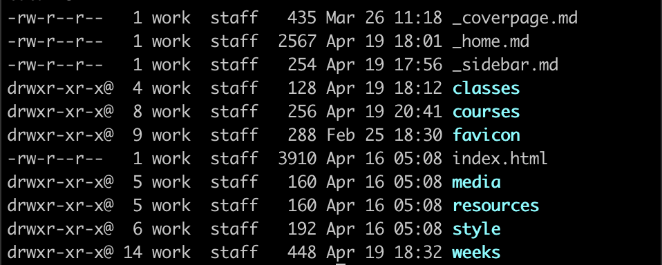
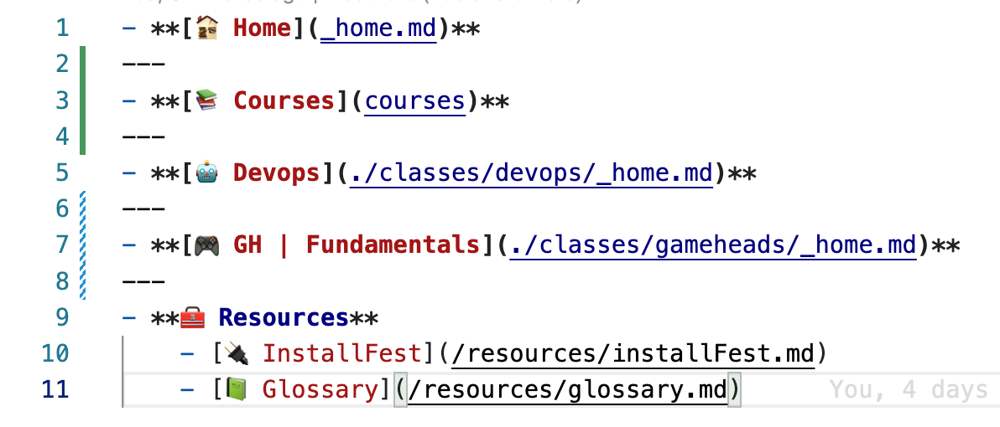
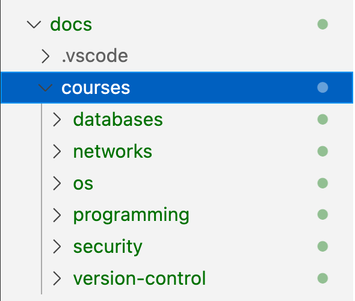

# Devops Classroom Outline

## `_home.md`

> Each page is set to _home.md when creating a new folder in the project.

## `_sidebar.md`

> This is the sidebar for current folder which can be set using markdown lists and links

## `courses`

> This is the folder where all the courses are stored. This folders co not container a home.md file, but contain subfolders which contain the course homepages

## `[course name]`

## `schedule`

## `resources`
