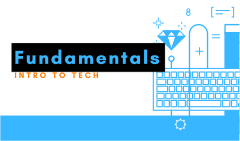

# Classes

> [!TIP]
> Select the class assigned to you to begin your courses. Scroll to the bottom for any updated links.

<!-- tabs:start -->

#### **Fundamentals**

Be prepared for the start of class __Saturday, March 19th, 2022__

> [!ATTENTION]
> - Take A Look at the prerequisites for next week, try and complete installs as soon as possible to ensure you do not fall behind, get on the stackoverflow page to ask questions and get help.

#### **Devops**

Be prepared for the start of class __Saturday, March 19th, 2022__
<!-- tabs:end -->

<!-- 

 -->