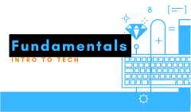

# Fundamentals

Welcome to the fudamental classes here at Gameheads.

>  This class is intended to build the fundamental principals of our curriculums topics.

We tackle topics with, databases, networks, operating systems, security, programming, security, version control and more to come.
use the sidebar to switch between your classes and courses. Email me or send a chat @ 3salaz.dev@gmail.com for any issues or questions. Thank you!
---
Make sure you, 

- Bookmark the classroom page
- Have a professional email
- Created a github account (https://github.com/)[https://github.com/]
- Created and (stackoverflow)[https://stackoverflow.com/] account, and joined the devops team.
- Connected to the class calendar
- Fill out evaluation form [here](https://docs.google.com/forms/d/1pu4Kerm9zIOmRS8WpvRl44PPvstDkh8l3hn2rhIw2Og/edit)
- Complete [Install Fest](../../resources/setup/installFest.md)
